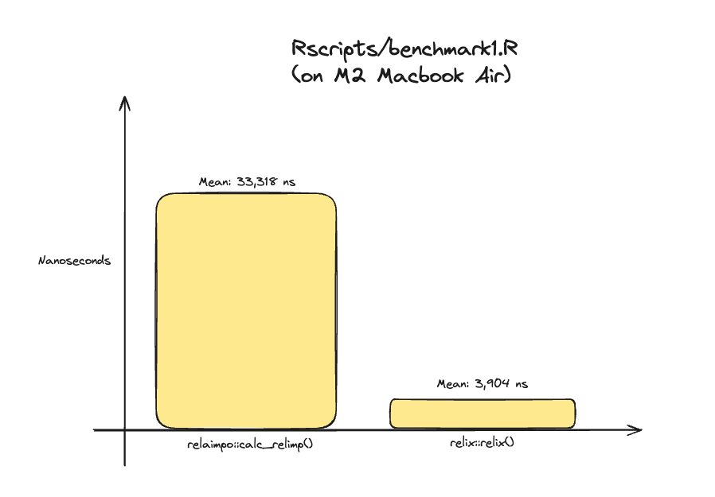
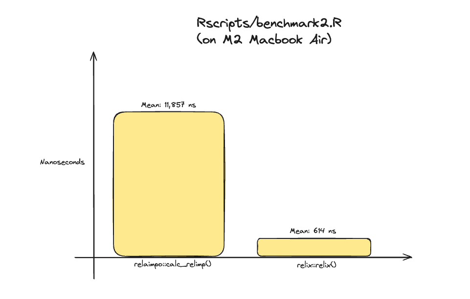

# Relix

Relix is a library to compute the relative importance of predictors in a linear regression. 

# Citations

## Relative Importance
This software is built using the methodology and principles of Relative Importance developed by Ulrike Groemping (Groemping, U. (2006). Relative Importance for Linear Regression in R: The Package relaimpo. Journal of Statistical Software, 17(1), 1–27. <doi:10.18637/jss.v017.i01>).

## Armadillo
Conrad Sanderson and Ryan Curtin.
Armadillo: a template-based C++ library for linear algebra.
Journal of Open Source Software, Vol. 1, No. 2, pp. 26, 2016.

Conrad Sanderson and Ryan Curtin.
Practical Sparse Matrices in C++ with Hybrid Storage and Template-Based Expression Optimisation.
Mathematical and Computational Applications, Vol. 24, No. 3, 2019.

# License
This project is licensed under the MIT License - see LICENSE.txt

This project includes:
- [Armadillo](https://arma.sourceforge.net)
  - The license can be found in `./LICENSE_Armadillo.txt`.
  - See `./NOTICE_Armadillo.txt`.
- [Boost](https://www.boost.org)
  - The license can be found in `./LICENSE_Boost.txt`.

# Overview
The original "relaimpo" package created by Ulrike Groemping has been immensely impactful. The code and underlying research are a significant contribution to the statistical community.

In the years since its release in 2006, the size of datasets has increased dramatically. Additionally techniques like bootstrapping involve running the same data pipelines repeatedly. Overall, this has resulted in larger data pipelines running on larger datasets. 

Relix was created to:
- Maximize the performance of calculating relative importance.
- Minimize the energy (cost, environmental) impact of calculating relative importance.
- Make relative importance cross-language (R, Python, C++).

# Performance
Benchmarks were invoked from the command line using `Rscript ./Rscripts/benchmark1.R` and `Rscript ./Rscripts/benchmark2.R`. Overall, we can see a significant speed increase.

Note: Unit tests showing accuracy can be found in tests/cpp/src.

## Benchmark 1 (MTCars - Relix is 8.53x Faster)

## Benchmark 2 (TLC Trip Record Data - Relix is 19.31x Faster)

# Installation
Please refer to the [project wiki](https://github.com/michhernand/relix/wiki) for the [C++ installation instructions](https://github.com/michhernand/relix/wiki/CPP-Installation) and [R installation instructions](https://github.com/michhernand/relix/wiki/R-Installation).

# Roadmap
- [X] "First" algorithm.
- [X] "Last" algorithm.
- [ ] (In Progress) v0.1 C++ release.
- [ ] (In Progress) v0.1 R release.
- [ ] (In Progress) v0.1 Python release.
- [ ] R Library on R-Forge.
- [ ] Python Library on Conda Forge.
- [ ] "LMG" algorithm.
- [ ] R Library on CRAN.
- [ ] Python Library on PyPI.
